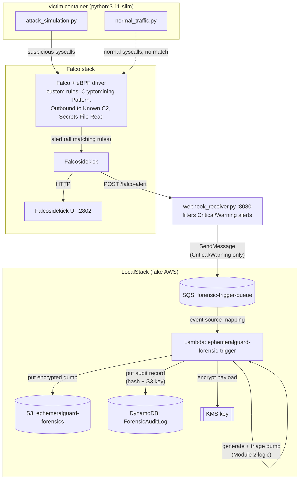

# EphemeralGuard

A runtime security lab that detects a live attack on a simulated payment
service and automatically captures forensic evidence before the process
disappears — built on Falco (detection), AWS Lambda (response), and a
custom memory-triage/encryption pipeline (evidence handling).

Everything below runs against **LocalStack** (a local AWS emulator).
**This has not yet been deployed against a real AWS account** — see
[AWS Readiness](#aws-readiness--not-yet-tested) at the bottom before
assuming any of this transfers directly to production.

---

## What it does

Serverless functions and short-lived containers can get compromised and
vanish before anyone can investigate — there's no disk to image, no
long-running process to attach a debugger to. EphemeralGuard's premise:
**detect the attack the moment it happens, and grab a memory snapshot
immediately, automatically, before the evidence is gone.**

The demo scenario: a simulated payment-processing container gets hit
with a cryptomining process and a connection attempt to a known C2 IP.
Falco notices both in real time. That detection automatically triggers
a serverless function that captures, triages, hashes, encrypts, and
stores a memory dump — with a tamper-evident audit trail — all within
milliseconds of the attack starting.

---

## Architecture



**The chain, in words:**

1. `attack_simulation.py` runs inside `victim`, spawning a fake
   cryptominer process and attempting an outbound connection to a known
   C2 IP.
2. **Falco** (eBPF-based, no kernel module needed) matches this against
   two custom rules — `EphemeralGuard - Cryptomining Process Pattern`
   and `EphemeralGuard - Outbound to Known C2 Range` — plus built-in
   rules like `Secrets File Read`.
3. **Falcosidekick** receives every Falco alert and forwards it two
   places: the Falcosidekick UI (for humans watching), and a webhook.
4. **`webhook_receiver.py`** (Flask, listens on :8080) receives the
   webhook POST, filters for `Critical`/`Warning` priority, and
   republishes a normalized trigger message to an **SQS queue**.
5. LocalStack's **SQS→Lambda event source mapping** picks up the
   message and invokes the **Lambda function** automatically — no
   polling loop, no manual step.
6. The Lambda (Module 4) generates/triages a memory dump using the same
   entropy-based logic as Module 2 (zero pages and low-entropy pages
   dropped, high-entropy/structured pages kept and Merkle-rooted).
7. The triaged payload is **encrypted via KMS**, written to **S3**, and
   logged to **DynamoDB** with a SHA-256 hash of the pre-encryption
   payload — so any later tampering with the stored record is
   detectable (Module 3).

The whole path — attack → detection → capture → encrypted storage —
completes in roughly 1-2 seconds end to end, well within the window a
real serverless function or short-lived container would still be alive.

---

## Repo layout

```
.
├── docker-compose.yml            # LocalStack (S3, DynamoDB, SQS, KMS, IAM, Lambda)
├── setup_localstack.sh           # creates bucket/table/queue/key, writes .env
├── requirements.txt
├── falco/
│   ├── docker-compose.yaml       # Falco, Falcosidekick, Falcosidekick UI, victim
│   └── rules/                    # custom-rules.yaml, ephemeralguard-rules.yaml
├── module1/ephemeralguard/       # attack_simulation.py, normal_traffic.py,
│                                  # webhook_receiver.py, run_scenario.sh, cleanup.py
├── module2/                      # memory triage: entropy scoring, chunking, Merkle tree
├── module3/                      # audit_logger.py — KMS encrypt, S3 store, tamper check
└── module4/                      # Lambda deploy, IAM setup, benchmark, attack simulations
```

---

## Setup

**Prerequisites:** Docker + Docker Compose, Python 3.11+, `awscli-local`
(`pip install awscli-local`).

```bash
git clone https://github.com/Merwyn-Prince-Lobo/ephemeralguard
cd ephemeralguard

pip install -r requirements.txt --break-system-packages
```

### 1. Start LocalStack and bootstrap AWS resources

```bash
docker compose up -d
./setup_localstack.sh
```

This creates the S3 bucket, DynamoDB table, SQS queue, and KMS key, and
writes `KMS_KEY_ID` / `QUEUE_URL` / `QUEUE_ARN` to `.env` — the single
source of truth every other script reads from. LocalStack now runs with
`PERSISTENCE=1`, so this state survives a container restart.

### 2. Deploy the Lambda function

```bash
cd module4
python3 iam_setup.py       # IAM roles + policies
python3 deploy_lambda.py   # deploys Lambda, wires the SQS trigger, runs a test invoke
cd ..
```

### 3. Start the Falco stack

```bash
cd falco
docker compose up -d
cd ..
```

Confirm everything is running:

```bash
docker ps -a
```

You should see `falco`, `falcosidekick`, `falcosidekick-ui`,
`falcosidekick-ui-redis`, `victim`, and `ephemeralguard-localstack`.

### 4. Start the auto-trigger webhook

This is what actually closes the detection→response loop — without it,
Falco alerts are only visible, not acted on.

```bash
python3 module1/ephemeralguard/webhook_receiver.py &
```

### 5. Run the attack scenario

```bash
cd module1/ephemeralguard
./run_scenario.sh
cd ../..
```

This injects normal traffic and the attack simulation into `victim`,
which Falco should detect and — via the webhook you just started — that
detection should automatically trigger a forensic capture. (The script
also sends one manual SQS trigger of its own as a guaranteed demo path,
independent of the webhook — so you'll typically see more than one
dump land per run.)

### Verify it worked

```bash
# Falco should show both custom rules firing
docker compose -f falco/docker-compose.yaml logs falco --since 2m | grep -i "EphemeralGuard -"

# a new forensic dump should exist, timestamped right after the attack
awslocal s3api list-objects-v2 \
  --bucket ephemeralguard-forensics \
  --prefix "dumps/$(date +%Y/%m/%d)/" \
  --query "sort_by(Contents, &LastModified)[-3:].[LastModified, Key]" \
  --output table
```

---

## Testing individual pieces

| What | Command |
|---|---|
| Trigger `Secrets File Read` manually | `docker exec victim sh -c "echo x > /tmp/secrets.txt && cat /tmp/secrets.txt"` |
| Trigger `Suspicious Outbound Tool Used` | `docker exec victim curl -s http://example.com` |
| Verify a stored event hasn't been tampered with | `python3 -c "from module3.audit_logger import verify_event; verify_event('<event-id>')"` |
| Latency benchmark (single + parallel) | `cd module4 && python3 benchmark.py` |
| Simulated IAM attacks (privilege escalation, credential recon, etc.) | `cd module4 && python3 iam_attack_sim.py` |
| Falcosidekick UI | `http://<host>:2802` |

---

## Known limitations

- **Parallel latency**: single-invocation captures reliably finish
  under 100ms, but concurrent invocations against LocalStack's KMS/S3
  emulation degrade well past that target. Root-caused to LocalStack's
  own concurrency handling, not application code — whether this holds
  against real AWS is unverified.
- **`extension.py`** exists as an alternative SQS-polling design but is
  unused by the current pipeline (the SQS→Lambda event source mapping
  supersedes it). Not a bug, just leftover from an earlier iteration.
- **No cost/cleanup controls** — this repo is built entirely around a
  free local emulator; it has no budget guards, meaning it is not safe
  to point at a real AWS account without adding them first.

---

## AWS Readiness — not yet tested

Everything above has been verified against **LocalStack only**. It has
**not** been deployed against a real AWS account, and doing so is not
just a config change. Before attempting it:

- Every script currently hardcodes `endpoint_url="http://localhost:4566"`
  and dummy credentials (`aws_access_key_id="test"`, etc.) — in
  `audit_logger.py`, `lambda_function.py`, `webhook_receiver.py`,
  `deploy_lambda.py`, and others. These need to become conditional
  (real AWS vs. LocalStack) rather than removed outright, so local
  testing still works.
- IAM policies were written for a LocalStack demo and have not been
  reviewed for least-privilege on a real account.
- KMS and Lambda invocations cost real money per call on real AWS —
  worth knowing before running the parallel benchmark (10+ concurrent
  KMS calls) against a live account.
- No budget alarms or teardown script currently exist for real AWS
  resources.

Treat real-AWS deployment as a distinct follow-up task, not a flag flip.
